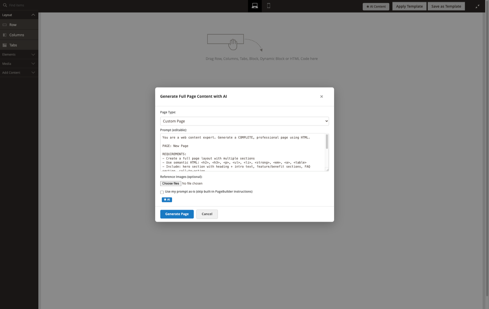
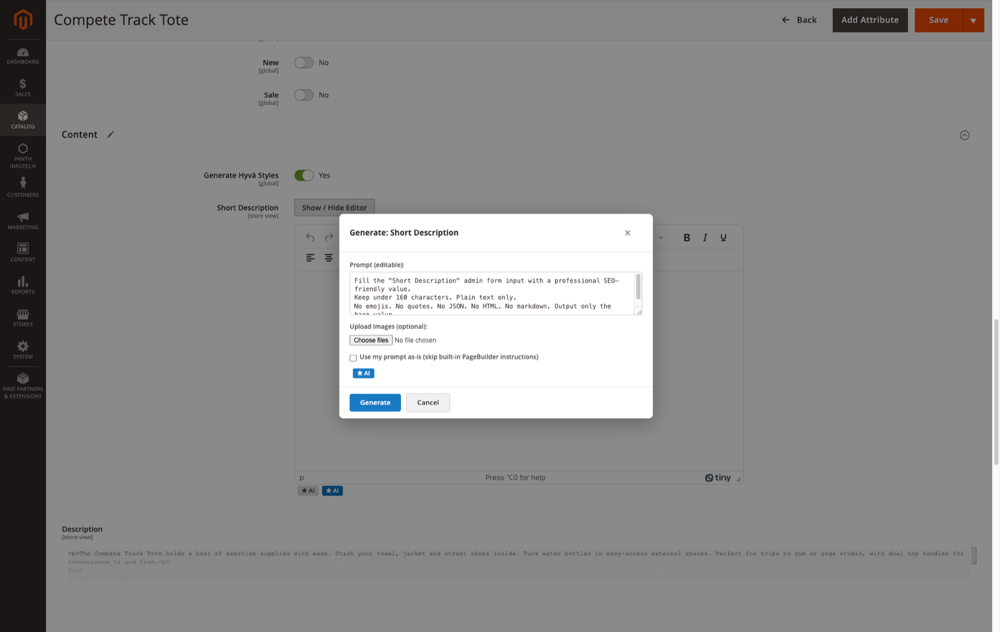
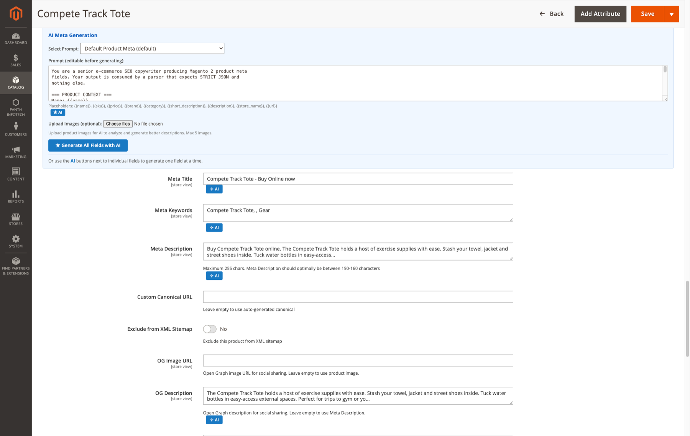
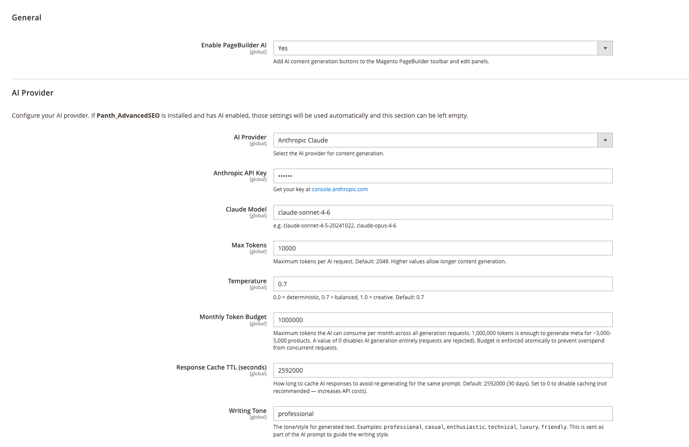
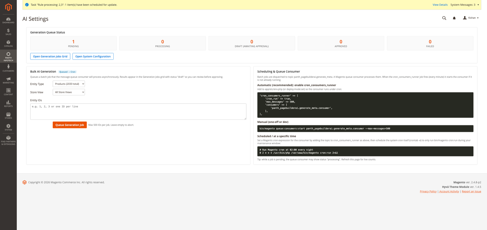
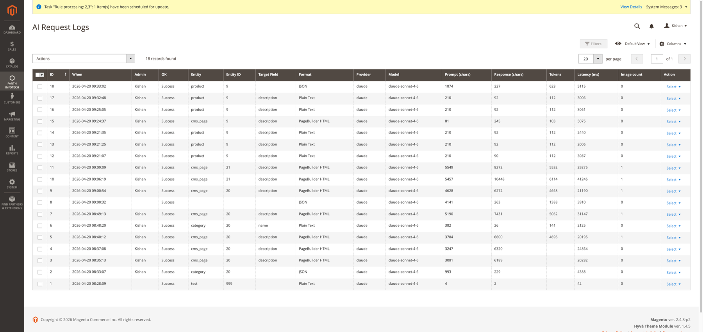

# Magento 2 PageBuilder AI

PageBuilder AI adds AI content generation to the Magento admin. Admins can do four things with it:

- generate a full page layout from the Magento Page Builder toolbar;
- fill individual content fields in Page Builder edit panels;
- generate meta and Open Graph text on product, category and CMS page forms;
- queue bulk meta title and meta description drafts for products, categories and CMS pages.

Two providers are supported: OpenAI (Chat Completions API) and Anthropic (Messages API). When an admin generates content, the module sends the selected provider the prompt, any store or entity data the prompt includes, and any reference images the admin attached. Nothing is sent from the storefront.

Product page: [kishansavaliya.com/magento-2-pagebuilder-ai.html](https://kishansavaliya.com/magento-2-pagebuilder-ai.html)

## Features

- **"AI Content" button on the Page Builder toolbar.** It opens the "Generate Full Page Content with AI" dialog, which has:
  - a "Page Type" preset list: Custom Page, Homepage, About Us, Contact Page, FAQ Page, Product Landing Page, Category Landing, Shipping & Returns, 404 Page;
  - an editable prompt;
  - optional reference images (up to 5);
  - a checkbox, "Use my prompt as-is (skip built-in PageBuilder instructions)", that sends your prompt without the module's built-in instructions.

  The browser sanitises the returned HTML (it removes scripts, iframes, forms, inline event handlers and `javascript:` links). The module then rebuilds the Page Builder stage from that HTML, which **replaces the existing stage content**.
- **Small AI buttons on content fields** in Page Builder edit panels and other admin forms.
  - Buttons appear only on an allowlist of content-authoring field names, for example name, title, description, content, the meta fields and URL key.
  - Each button opens the same compact panel used by the other AI buttons, titled `Generate: <field label>` (the form label, or the field code in title case when the field has no label), with an editable prompt, Generate and Cancel.
  - The default prompt matches the field type: rich-text (WYSIWYG) fields ask for clean HTML, which the browser sanitises before writing it into the editor; other fields ask for a bare plain-text value that replaces the field's value.
- **"AI Meta Generation" panels** on the product, category and CMS page edit forms. Each panel has a saved-prompt selector, an editable prompt, image upload and per-field AI buttons:
  - Product: Product Name, Description, Short Description, Meta Title, Meta Description, Meta Keywords, OG Title, OG Description.
  - Category: Category Name, Meta Title, Meta Description, Meta Keywords, OG Title, OG Description.
  - CMS page: Meta Title, Meta Description, Meta Keywords, Content Heading.
- **Extra SEO fields** added to the same forms by the same plugins:
  - Meta Robots, OG Title, OG Description, OG Image URL and Exclude from XML Sitemap.
  - Custom Canonical URL (products only), shown only when the `panth_seo_custom_canonical` table exists.
  - Search Engine Optimization / Meta Robots and Hreflang Identifier (CMS pages), shown only when the `panth_seo_override` table exists. Values entered while creating a new page are saved with the page's first save.

  See [Developer Notes](#developer-notes) for where those values are stored.
- **Prompt placeholders** are filled in on the server from the product, category or CMS page record. Supported placeholders: `{{name}}`, `{{sku}}`, `{{price}}`, `{{category}}`, `{{description}}`, `{{short_description}}`, `{{title}}`, `{{identifier}}`, `{{url}}`. Any placeholder that cannot be filled is removed.
- **AI buttons on other Panth modules' forms**, active only when those modules are installed:
  - FAQ item: FAQ Answer, meta fields.
  - Testimonial: Testimonial Content, Short Excerpt, Testimonial Title.
  - Banner slide: Slide Title, Content Overlay HTML, Image Alt Text.
  - Dynamic form: Form Description, Content Above Form, Content Below Form, Success Message, meta fields.
- **AI Prompts grid.** Stores saved prompt templates per entity type (`product`, `category`, `cms_page`, `pagebuilder`, `all`), each with default and active flags. Data patches install a set of default templates.
- **AI Knowledge Base grid.** Stores guideline entries on Page Builder, SEO, e-commerce, accessibility, response format, copywriting and Panth module topics.
  - On the bulk path, matching active entries are appended to prompts.
  - A data patch installs the entries. The grid's import button adds any bundled entries that are missing, matched by category and title.
- **Bulk generation.**
  - Queue a job for up to 500 product, category or CMS page IDs from the "AI Dashboard" page.
  - A message-queue consumer generates meta title and meta description drafts.
  - You review the drafts in the "AI Generation Jobs" grid and apply them with "Approve Selected".
- **AI Request Logs grid and detail view.** Each provider call is logged with the admin user, entity, target field, output format, provider, model, token count, latency, HTTP status, and the full prompt and response.
- **Keyword search** on the AI Prompts (name, entity type), AI Knowledge Base (title, category, subcategory, tags), AI Generation Jobs (UUID, entity type, status, provider) and AI Request Logs (admin user, entity type, target field, provider, model) grids.
- **Monthly token budget and response cache**, which apply to the bulk path only (see [Configuration](#configuration)).
- **Key storage and outbound calls.** API keys are stored encrypted. Outbound calls are limited to HTTPS requests to `api.openai.com` and `api.anthropic.com`.







## Compatibility

| Item | Supported |
|---|---|
| Magento Open Source | 2.4.4 to 2.4.8 |
| Adobe Commerce | 2.4.4 to 2.4.8 |
| PHP | 8.1, 8.2, 8.3, 8.4 |
| Magento Page Builder | Required (`Magento_PageBuilder`) |

Composer constraints:

- PHP: `~8.1.0||~8.2.0||~8.3.0||~8.4.0`
- Magento: `magento/framework ^103.0`, `magento/module-backend ^102.0`, `magento/module-page-builder ^2.2`
- Also required: `mage2kishan/module-core ^1.0`

## Requirements

- Magento Page Builder enabled (`Magento_PageBuilder`).
- `Panth_Core`, which Composer installs as `mage2kishan/module-core`.
- An API key for the provider you select, either OpenAI or Anthropic. The provider bills usage to your account.
- Outbound HTTPS from the Magento server to `api.openai.com` or `api.anthropic.com`.
- For bulk jobs: Magento cron must be running. Optionally, register the queue consumer `panth_pagebuilderai.generate_meta.consumer` under `cron_consumers_runner` (see [Usage](#usage)).

Interactive generation in the admin does not need cron.

## Installation

```bash
composer require mage2kishan/module-pagebuilder-ai
bin/magento module:enable Panth_Core Panth_PageBuilderAi
bin/magento setup:upgrade
bin/magento setup:di:compile   # production mode only
bin/magento setup:static-content:deploy -f
bin/magento cache:flush
```

Check that the module is enabled:

```bash
bin/magento module:status Panth_PageBuilderAi
```

The module defines a database queue consumer for bulk jobs. To run it manually:

```bash
bin/magento queue:consumers:start panth_pagebuilderai.generate_meta.consumer --max-messages=500
```

## Configuration

Admin path: **Stores > Configuration > Panth Extensions > PageBuilder AI**.

- The "Panth Extensions" tab is provided by `Panth_Core`.
- All fields can be set at Default Config scope only.
- Access is controlled by the ACL resource `Panth_PageBuilderAi::config`.



**General** (`panth_pagebuilderai/general`)

| Field | Type | Default | Config path | Notes |
|---|---|---|---|---|
| Enable PageBuilder AI | Yes/No | Yes | `panth_pagebuilderai/general/enabled` | Adds the AI buttons and the extra SEO fields in the admin. |

**AI Provider** (`panth_pagebuilderai/ai`)

| Field | Type | Default | Config path | Notes |
|---|---|---|---|---|
| AI Provider | Select: "OpenAI (GPT-4o)", "Anthropic Claude", "Disabled (None)" | `openai` | `panth_pagebuilderai/ai/provider` | |
| OpenAI API Key | Obscured, encrypted | (empty) | `panth_pagebuilderai/ai/openai_api_key` | Shown when AI Provider is OpenAI. |
| OpenAI Model | Text | `gpt-4o` | `panth_pagebuilderai/ai/openai_model` | Admin hint: e.g. gpt-4o, gpt-4o-mini, gpt-4-turbo. |
| Anthropic API Key | Obscured, encrypted | (empty) | `panth_pagebuilderai/ai/claude_api_key` | Shown when AI Provider is Anthropic Claude. |
| Claude Model | Text | `claude-sonnet-4-6` | `panth_pagebuilderai/ai/claude_model` | Admin hint: e.g. claude-sonnet-4-6, claude-opus-4-6. If the field is empty, the code falls back to `claude-sonnet-4-6`. |
| Max Tokens | Text (digits) | `8192` | `panth_pagebuilderai/ai/max_tokens` | Maximum output tokens per request. |
| Temperature | Text | `0.7` | `panth_pagebuilderai/ai/temperature` | |
| Monthly Token Budget | Text (digits) | `1000000` | `panth_pagebuilderai/ai/monthly_budget` | Bulk path only. A value of `0` rejects bulk requests. |
| Response Cache TTL (seconds) | Text (digits) | `2592000` | `panth_pagebuilderai/ai/cache_ttl` | Bulk path only. A value of `0` disables the cache. |
| Writing Tone | Text | `professional` | `panth_pagebuilderai/ai/tone` | Interactive path only. Added to the system prompt as `Writing tone: <value>.` (letters, digits, spaces, commas and hyphens, up to 60 characters). |

API keys are saved with Magento's `Encrypted` backend model, so they are stored encrypted in `core_config_data`. The model fields are free text: enter any model ID that your provider account can use.

The two request paths use these settings differently.

**Interactive generation** covers the toolbar, the field buttons and the meta panels, all of which go through `panth_pagebuilderai/generate/index`.

- It uses the provider, API key, model, Max Tokens, Temperature and Writing Tone settings.
- Each request has a 10 second connect timeout and a 120 second total timeout, and is not retried.
- Its requests do not count against the Monthly Token Budget.
- Its responses are not cached.
- Its usage is not written to the usage table. The calls are written to the request log.

**Bulk jobs** use the provider adapters.

- Before each call, the adapter reserves an estimated `2 x Max Tokens` against the month's budget.
- After the call, it corrects the reservation to the token count the provider reports.
- Responses are cached under a SHA-256 hash of the provider, model and prompt.
- Each HTTP attempt has a 10 second connect timeout and a 60 second timeout. Failed attempts (HTTP 429, 5xx or a network error) are retried up to 3 attempts in total, and all attempts for one call stop after 120 seconds.

## Usage

**Generate a page in Page Builder**

1. Open a CMS page, or another form with a Page Builder stage, and click **AI Content** on the Page Builder toolbar.
2. Choose a Page Type preset or keep Custom Page, then edit the prompt.
3. Optionally attach up to 5 reference images. The browser skips files over 5 MB. The server accepts only PNG, JPEG, GIF and WebP data URIs of up to 4,000,000 characters each and rejects the request otherwise.
4. Click **Generate Page**. The result replaces the current stage content.
5. Review the result in the editor. Nothing is saved until you save the page.

**Fill a single field**

1. Click the small AI button next to an eligible field.
2. Adjust the prompt and generate. The value is written into that field only.
3. Review the value and save the form as usual.

**Bulk meta drafts**

1. Open the **AI Dashboard** admin page. Its menu entry sits under the `Panth_Core` extensions menu.
2. Under "Bulk AI Generation", choose Entity Type (Products, Categories, CMS Pages) and Store View.
3. Enter entity IDs, comma separated or one per line. The form keeps the first 500, and the server rejects a job with more than 500 distinct IDs.
4. Click **Queue Generation Job**. This creates a job with status `pending` and publishes a message to the topic `panth_pagebuilderai.generate_meta`.
5. The consumer builds context for each entity and generates a meta title and meta description. It then sets the job to `draft`, or to `failed` if no entity produced output. The consumer only processes jobs in `pending` status. A job found in `processing` status (interrupted earlier) is set to `failed` and is not retried.
6. In **AI Generation Jobs**, open a job and review its drafts.
7. Use **Approve Selected** to write `meta_title` and `meta_description` to the entities. Products and categories are saved at the job's store view; CMS pages are saved without a store scope. Only jobs in `draft` status can be approved.
8. Use **Delete Selected** to remove jobs.



**Running the queue**

Messages are processed in one of two ways.

- **Recommended:** add the consumer to `cron_consumers_runner` in `app/etc/env.php`. This is the same snippet the AI Dashboard shows:

  ```php
  'cron_consumers_runner' => [
      'cron_run' => true,
      'max_messages' => 500,
      'consumers' => [
          'panth_pagebuilderai.generate_meta.consumer',
      ],
  ],
  ```

- **Fallback cron job:** `panth_pagebuilderai_drain_queue` runs in group `default` on the schedule `*/5 * * * *`. Each run:
  - takes a lock named `panth_pagebuilderai_drain_queue` and exits at once if a previous run still holds it;
  - reads messages from `panth_pagebuilderai.generate_meta.q` without waiting for new ones, so it returns as soon as the queue is empty;
  - processes at most 50 messages and stops starting new provider calls after 150 seconds. Entities not reached in that time are counted as failed and the job's error message says so;
  - acknowledges each processed message. A message that throws is rejected without being requeued.

**Console commands**

The module adds no console commands of its own. To run the consumer, use Magento's `queue:consumers:start panth_pagebuilderai.generate_meta.consumer` (see [Installation](#installation)).

**Prompts, knowledge base and logs**

- **AI Prompts:** create or edit templates, and mark one default per entity type. Name and template are required.
- **AI Knowledge Base:** edit entries (title and content are required), or use the import button to add missing bundled entries.
- **AI Request Logs:** view each call with its full prompt and response. You can delete single rows or use mass delete. The grid shows the key columns by default; entity ID, format, model, prompt and response length, latency and image count can be added from the Columns menu.



## Data and privacy

Requests go directly from the Magento server to the selected provider:

- **OpenAI:** `https://api.openai.com/v1/chat/completions`, with the key in an `Authorization: Bearer` header.
- **Anthropic:** `https://api.anthropic.com/v1/messages`, with `x-api-key` and `anthropic-version: 2023-06-01` headers.

Nothing is sent until an admin clicks a generate button or the queue consumer processes a job. Every request includes the model, max tokens and temperature. OpenAI bulk requests also ask for `logprobs`.

**Interactive generation** (toolbar, field buttons, meta panels) sends:

- The prompt text as the admin edited it, with placeholders filled from the database:
  - CMS page: title, identifier, and content with tags stripped (up to 2,000 characters).
  - Product: name, SKU, price, description and short description with tags stripped (up to 2,000 characters each), and one category name.
  - Category: name, URL key, and description (up to 2,000 characters).
- The module's built-in Page Builder or plain-field instructions, unless "Use my prompt as-is" is ticked.
- Up to 5 reference images, as base64 data URIs.

**Bulk jobs** send a prompt built from the entity type's default AI prompt template. If no template exists, a built-in meta prompt is used. The prompt contains:

- Entity data:
  - Product: name, SKU, brand, image path, price, and description with tags stripped (first 1,200 characters).
  - Category: name, image URL, description.
  - CMS page: title and content.
- A store context block:
  - store name, store phone, country, base currency and locale;
  - the free-shipping threshold, if free shipping is enabled;
  - the default page title and the title separator.
- Fixed SEO rules and matching knowledge base entries, each shortened to 200 characters.

**Stored locally**

- **Request log** (`panth_pagebuilderai_request_log`):
  - Columns: admin username, entity type and ID, store ID, target field, output format, provider, model, prompt and response (each up to 1,000,000 characters), image count, token count, latency, HTTP status and error message.
  - The module does not delete these rows automatically.
- **Reference images** from interactive requests:
  - Written to `var/panth_pagebuilderai/request-log/<timestamp_bucket>/`, with their paths stored in `images_json`. Only files that decode as PNG, JPEG, GIF or WebP are written, with the extension taken from the detected type.
  - The `var` directory is not served by the web server. The log detail page embeds the images inline.
  - Versions before 1.2.21 wrote these images to `pub/media/panth_pagebuilderai/request-log/`. Those files are not moved; the log detail page still links to them. Delete that directory if the images are sensitive.
  - Deleting a log row does not delete its image files.
- **Response cache** (`panth_seo_ai_cache`): cached bulk responses, keyed by a SHA-256 hash, with an expiry time.
- **Usage** (`panth_seo_ai_usage`): tokens per provider per month on the bulk path. The table has a `cost_usd` column, but the code does not fill it.
- **Jobs** (`panth_seo_generation_job`): entity IDs, plus the draft titles and descriptions in the `options` JSON.
- **API keys:** stored encrypted in `core_config_data`.

## Developer Notes

**Identifiers**

- Module: `Panth_PageBuilderAi`
- Package: `mage2kishan/module-pagebuilder-ai`
- Namespace: `Panth\PageBuilderAi\`
- Load order: after `Panth_Core` and `Magento_PageBuilder`

**Relationship to `mage2kishan/module-advanced-seo`**

- `composer.json` lists it under `suggest` only, not `require`. `etc/module.xml` has no sequence entry for it.
- The composer description says the Panth_AdvancedSEO AI settings are used when that module is installed. The code does not do this: `Helper\Config::isAdvancedSeoAvailable()` returns `false`, and nothing calls into Panth_AdvancedSEO. This module always uses its own provider settings.
- `Api\AiGeneratorInterface` replaces the legacy `Panth\AdvancedSEO\Api\MetaGeneratorInterface`.
- The tables keep their legacy `panth_seo_*` names so that rows from earlier Panth_AdvancedSEO installs are reused.
- The extra SEO form fields read and write the `panth_seo_override` and `panth_seo_custom_canonical` tables. This module does not create them. When a table is missing, the fields that depend on it are not added to the form.

**Provider extension point**

- `Api\AiGeneratorInterface` defines `generate()`, `getProvider()` and `getLastUsageTokens()`. `etc/di.xml` binds it to `Model\Generator\AdapterFactory`.
- The factory resolves `ClaudeAdapter`, `OpenAiAdapter` or `NullAdapter` from `panth_pagebuilderai/ai/provider`.
- `Model\Generator\AbstractHttpAdapter` holds the shared HTTP, budget, cache, prompt and audit logic.
- Interactive requests use `Model\AiService` instead.
- The outbound host allowlist is hard-coded in both classes.

**Queue**

| Element | Value |
|---|---|
| Topic | `panth_pagebuilderai.generate_meta` |
| Exchange | `panth_pagebuilderai.exchange` |
| Queue | `panth_pagebuilderai.generate_meta.q` |
| Connection | `db` |
| Consumer | `panth_pagebuilderai.generate_meta.consumer` |
| Handler | `Model\Queue\BulkGenerateConsumer::process` |

**Plugins** (`etc/adminhtml/di.xml`)

- The Magento product, category and CMS page form data providers, and the CMS page save controller.
- The data providers of `Panth_Faq`, `Panth_Testimonials`, `Panth_BannerSlider` and `Panth_DynamicForms`. These plugins are ignored when the target classes do not exist.

**Admin route and endpoints**

The admin route is `panth_pagebuilderai`. Main endpoints:

- `generate/index`: interactive generation.
- `aigenerate/generate`: an adapter-based JSON endpoint. The bundled UI does not call it.
- `aisettings/generateBatch`: queues a bulk job.
- `aisettings/approveBatch`: approves draft jobs.

All POST endpoints, including `generate/index` and `aigenerate/generate`, go through Magento's admin form key check. The bundled scripts send `form_key` in the query string, so JSON request bodies also pass the check. Deleting a request log row is a POST action.

**Page Builder integration**

- When the module is enabled, `view/adminhtml/layout/default.xml` adds `pagebuilder-ai-init.phtml` and `web/css/pagebuilder-ai.css` to every admin page.
- `web/js/pagebuilder-ai-toolbar.js` injects the buttons and rebuilds the stage through `Magento_PageBuilder/js/stage-builder`.
- After inserting content, the script dispatches a `panth:pagebuilder-ai:content-injected` DOM event.

**ACL**

- `Panth_PageBuilderAi::config`, under Stores > Settings > Configuration.
- `Panth_PageBuilderAi::ai_manage`, with the children `ai_generate`, `ai_settings`, `ai_jobs`, `ai_prompts`, `ai_knowledge` and `ai_request_logs`.
- `Panth_PageBuilderAi::generate`, used by `generate/index`.

**Admin menu**

Under the parent `Panth_Core::panth_extensions`: AI Dashboard, AI Generation Jobs, AI Prompts, AI Knowledge Base, AI Request Logs.

**Tables** (`etc/db_schema.xml`)

`panth_seo_ai_prompt`, `panth_seo_ai_knowledge`, `panth_seo_ai_usage`, `panth_seo_ai_cache`, `panth_seo_generation_job`, `panth_pagebuilderai_request_log`.

**Data patches**

The data patches install the default AI prompts, upgrade those default prompts, and load the knowledge base entries from `Setup/Data/`.

**Tests**

Unit tests in `Test/Unit` cover the drain cron job (message and time budget, lock, empty queue, rejected messages, interrupted jobs) and the HTTP timeout and host checks of the provider adapters. They use stubs and make no network calls.

## Uninstallation

```bash
bin/magento module:disable Panth_PageBuilderAi
composer remove mage2kishan/module-pagebuilder-ai
bin/magento setup:upgrade
bin/magento cache:flush
```

The module has no uninstall routine. After removal, the following remain:

- The tables `panth_seo_ai_prompt`, `panth_seo_ai_knowledge`, `panth_seo_ai_usage`, `panth_seo_ai_cache`, `panth_seo_generation_job` and `panth_pagebuilderai_request_log`.
- All `panth_pagebuilderai/*` rows in `core_config_data`, including the encrypted OpenAI and Anthropic API keys.
- Logged reference images under `var/panth_pagebuilderai/request-log/`, and under `pub/media/panth_pagebuilderai/request-log/` from versions before 1.2.21.
- Any unprocessed messages for the `panth_pagebuilderai.generate_meta.q` queue.

Remove these by hand if you no longer need them, but check first whether another Panth module still uses the `panth_seo_*` tables. Consider also revoking the API keys at the provider.

## Support

- Product page: [kishansavaliya.com/magento-2-pagebuilder-ai.html](https://kishansavaliya.com/magento-2-pagebuilder-ai.html)
- Contact: [kishansavaliya.com/contact](https://kishansavaliya.com/contact)
- Email: kishansavaliyakb@gmail.com
- GitHub issues: [github.com/mage2sk/module-pagebuilder-ai/issues](https://github.com/mage2sk/module-pagebuilder-ai/issues)

Provider documentation:

- [OpenAI API reference: Chat](https://developers.openai.com/api/reference/resources/chat)
- [Anthropic Messages API](https://docs.claude.com/en/api/messages)
- [Anthropic API keys](https://console.anthropic.com/settings/keys)

## Documentation

See [USER_GUIDE.md](USER_GUIDE.md).

## License

Commercial software license. See [LICENSE.txt](LICENSE.txt) in this repository.

## Changelog

See [CHANGELOG.md](CHANGELOG.md).

## Links

- Website: [kishansavaliya.com](https://kishansavaliya.com)
- All extensions catalogue: [kishansavaliya.com/magento-extensions.html](https://kishansavaliya.com/magento-extensions.html)
- GitHub: [github.com/mage2sk/module-pagebuilder-ai](https://github.com/mage2sk/module-pagebuilder-ai)
- Packagist: [mage2kishan/module-pagebuilder-ai](https://packagist.org/packages/mage2kishan/module-pagebuilder-ai)
